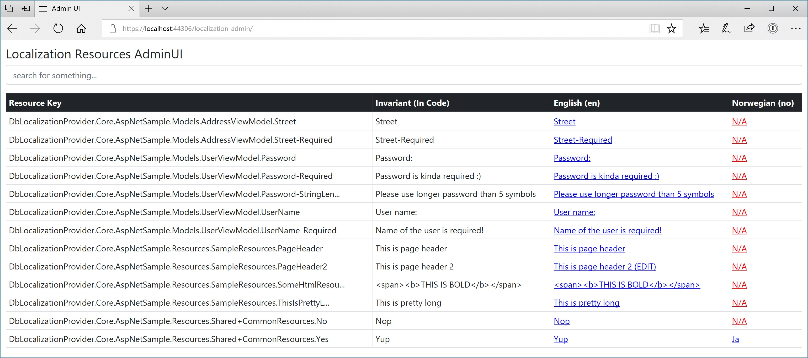

## Installation

The only thing you need to do to get started is to install following package.

```
PM> Install-Package LocalizationProvider.AdminUI.AspNetCore
```

It will also bring down all the other necessary packages for library to work correctly.

## Setup & Customization

Essentially there are 2 parts of the whole setup process:

* Configure Services
* Configure Library

Configuration of the services is part of the Asp.Net Core dependency injection process setup. So to add AdminUI to you application you need (in `Startup.cs`):

### Configure Localization Provider Services

```csharp
public void ConfigureServices(IServiceCollection services)
{
    services.AddLocalization();
    services.AddMvc()
        .AddViewLocalization()
        .AddDataAnnotationsLocalization();

    // just adding English and Norwegian support
    services.Configure<RequestLocalizationOptions>(opts =>
    {
        var supportedCultures = new List<CultureInfo>
                                {
                                    new CultureInfo("en"),
                                    new CultureInfo("no")
                                };

        opts.DefaultRequestCulture = new RequestCulture("en");
        opts.SupportedCultures = supportedCultures;
        opts.SupportedUICultures = supportedCultures;
    });
}

public void Configure(IApplicationBuilder app, IHostingEnvironment env)
{
    var options = app.ApplicationServices.GetService<IOptions<RequestLocalizationOptions>>();
    app.UseRequestLocalization(options.Value);

}
```

### Setup Library

And when built-in support is configured, you can now add support for DbLocalizationProvider library (again in `Startup.cs`):

```csharp
public void ConfigureServices(IServiceCollection services)
{
   services.AddDbLocalizationProvider(_ =>
   {
       ...
   });
   
   services.AddDbLocalizationProviderAdminUI(_ =>
   {
       ...
   });
}
```

Through these methods you can customize behavior for the library and AdminUI component.

And when you are done with customization, you need to add those to the application:

```csharp
public void Configure(IApplicationBuilder app, IHostingEnvironment env)
{
   app.UseDbLocalizationProvider();
   app.UseDbLocalizationProviderAdminUI();
}
```

## Accessing UI

When everything is setup correctly and Asp.Net Core runtime does not blame you for incorrect configuration, you may access AdminUI via `.../localization-admin` url (by default).



### Change Default Route for AdminUI

By default AdminUI is mapped to `/localization-admin` url. If you want to change url for the AdminUI application -> just specify if via `AddDbLocalizationProviderAdminUI` configuration method:

```
public void ConfigureServices(IServiceCollection services)
{
    ...
    services.AddDbLocalizationProviderAdminUI(_ =>
                                              {
                                                  _.RootUrl = "/localization-admin";
                                                  ...
                                              });
}
```
